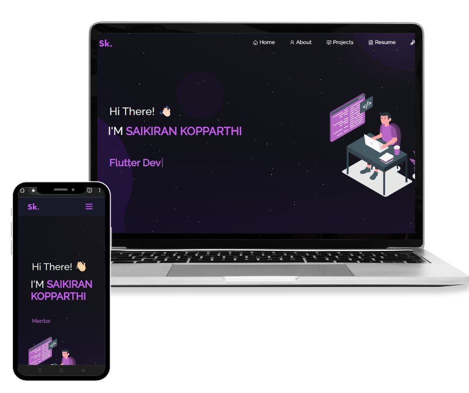

<h2 align="center">
  Portfolio Website - v1.0.0 
  <a href="https://saikirankopparthi.engineer" target="_blank">saikirankopparthi.engineer</a>
</h2>

  

 

 &nbsp;
 &nbsp;
 &nbsp;
 &nbsp;

<h3 align="center">
    🔹
    <a href="https://github.com/saikiran1224/Portfolio/issues">Report Bug</a> &nbsp; &nbsp;
    🔹
    <a href="https://github.com/saikiran1224/Portfolio/issues">Request Feature</a>
</h3>

## Domain Details

The domain <a href="http://saikirankopparthi.engineer/" target="_blank">saikirankopparthi.engineer</a> is bought from <a href="https://name.com">Name.com</a> for free under the GitHub Student Developer Pack. I am very much thankul for GitHub for providing this opportunity.

## Hosting

This site is hosted on **GitHub Pages** and custom domain is enabled. 

## Built With

My personal portfolio which features some of my github projects as well as my resume and technical skills. 

This project was built using these technologies.

- React.js
- Node.js
- Express.js
- CSS3
- VsCode
- Vercel

## Features

**📖 Multi-Page Layout**

**🎨 Styled with React-Bootstrap and Css with easy to customize colors**

**📱 Fully Responsive**

## Getting Started

Clone down this repository. You will need `node.js` and `git` installed globally on your machine.

## 🛠 Installation and Setup Instructions

1. Installation: `npm install`

2. In the project directory, you can run: `npm start`

Runs the app in the development mode.\
Open [http://localhost:3000](http://localhost:3000) to view it in the browser.
The page will reload if you make edits.

## Usage Instructions

Open the project folder and Navigate to `/src/components/`.  
You will find all the components used and you can edit your information accordingly.

## Credits

This project is initially developed by [Soumyajit4419](https://github.com/soumyajit4419/Portfolio) and link back to him if you use this website. Thanks! 

## Show your support

Give a ⭐ if you like this website!
